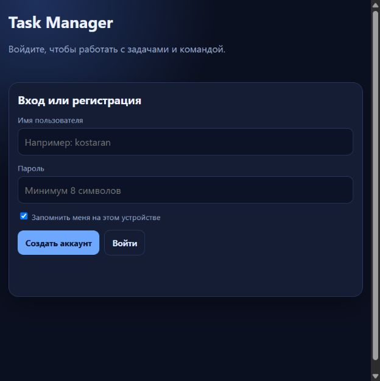
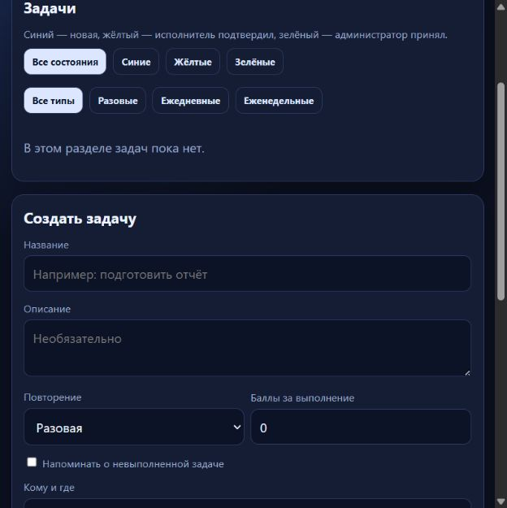
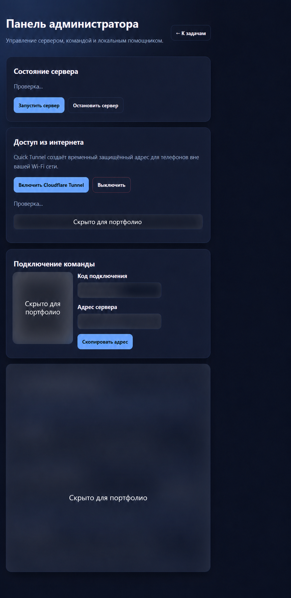

# Secure Task Manager

Полнофункциональный локальный Task Manager для личных и командных задач. Проект демонстрирует не только разработку API, но и production-oriented подход: авторизацию, роли, контейнеризацию, тестирование, мониторинг, AppSec и подготовку к Kubernetes.



## Возможности

- регистрация и вход с JWT, опцией «запомнить меня» и Google OAuth;
- личные и командные задачи, исполнитель, описание и баллы за выполнение;
- статусы: новая → отправлена на проверку → подтверждена;
- повторяющиеся ежедневные и еженедельные задачи;
- фильтры по статусу и типу задачи;
- группы, участники и управление приоритетами;
- разграничение прав участника и администратора сервера;
- QR-подключение мобильных устройств к локальному серверу;
- локальный текстовый и голосовой AI-помощник без передачи задач сторонним AI API;
- Prometheus-метрики и Grafana-дашборды.





## Технологии

- Python 3.12, FastAPI, SQLAlchemy, PostgreSQL;
- JWT, Argon2, Google OAuth;
- Docker Compose;
- Prometheus и Grafana;
- GitHub Actions: CI, Semgrep, Trivy и release pipeline;
- Kubernetes: Deployments, probes, HPA, Ingress, resource limits и security context;
- Cloudflare Worker для безопасного внешнего доступа.

## Быстрый запуск

1. Скопируйте `.env.example` в `.env` и замените демонстрационные секреты.
2. Запустите окружение:

   ```bash
   docker compose up --build
   ```

3. Откройте:
   - приложение: `http://localhost:8000`;
   - API-документацию: `http://localhost:8000/docs`;
   - Prometheus: `http://localhost:9090`;
   - Grafana: `http://localhost:3000`.

## Проверка качества

```bash
python -m pip install -r requirements-dev.txt
python -m pytest -q
```

GitHub Actions автоматически запускает тесты, Docker build, Semgrep-анализ и Trivy-сканирование образа для изменений в основной ветке и pull request.

## Документация

- [Архитектура](docs/ARCHITECTURE.md)
- [Аутентификация](docs/AUTHENTICATION.md)
- [Security case study](docs/SECURITY_CASE_STUDY.md)
- [Демонстрация для интервью](docs/PORTFOLIO_DEMO.md)
- [Руководство пользователя RU/EN](docs/USER_GUIDE_RU_EN.md)

## Что демонстрирует проект

- проектирование REST API и ролевого доступа;
- безопасную работу с паролями и секретами;
- DevSecOps-процесс от тестов и сканирования до контейнерного образа;
- наблюдаемость приложения через метрики и дашборды;
- готовность сервиса к развёртыванию в Kubernetes.
